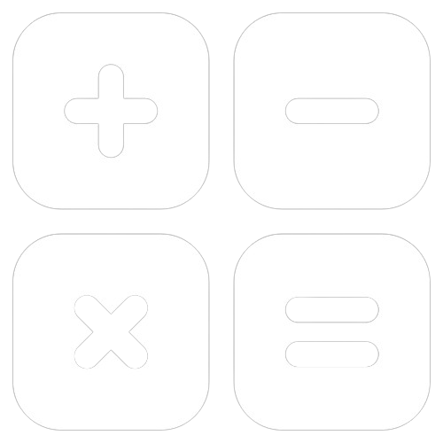

<!DOCTYPE html>
<html lang="en">
<head>
    <meta charset="UTF-8">
    <meta name="viewport" content="width=device-width, initial-scale=1.0">
    <title>Blue Glass Calculator - Regular</title>
    
</head>
<body>

    

        

            
            calculator
        

        
0

        

            <button class="btn-clear" onclick="clearDisplay()">C</button>
            <button class="btn-op-top" onclick="appendOperator('(')">(</button>
            <button class="btn-op-top" onclick="appendOperator('%')">%</button>
            <button class="btn-op-side" onclick="appendOperator('/')">÷</button>

            <button class="btn-num" onclick="appendNumber('7')">7</button>
            <button class="btn-num" onclick="appendNumber('8')">8</button>
            <button class="btn-num" onclick="appendNumber('9')">9</button>
            <button class="btn-op-side" onclick="appendOperator('*')">×</button>

            <button class="btn-num" onclick="appendNumber('4')">4</button>
            <button class="btn-num" onclick="appendNumber('5')">5</button>
            <button class="btn-num" onclick="appendNumber('6')">6</button>
            <button class="btn-op-side" onclick="appendOperator('-')">−</button>

            <button class="btn-num" onclick="appendNumber('1')">1</button>
            <button class="btn-num" onclick="appendNumber('2')">2</button>
            <button class="btn-num" onclick="appendNumber('3')">3</button>
            <button class="btn-op-side" onclick="appendOperator('+')">+</button>

            <button class="btn-num" onclick="appendNumber('.')">.</button>
            <button class="btn-num" onclick="appendNumber('0')">0</button>
            <button class="btn-num" onclick="deleteLast()">⌫</button>
            <button class="btn-equal" onclick="calculateResult()">=</button>
        

    

    
</body>
</html>
